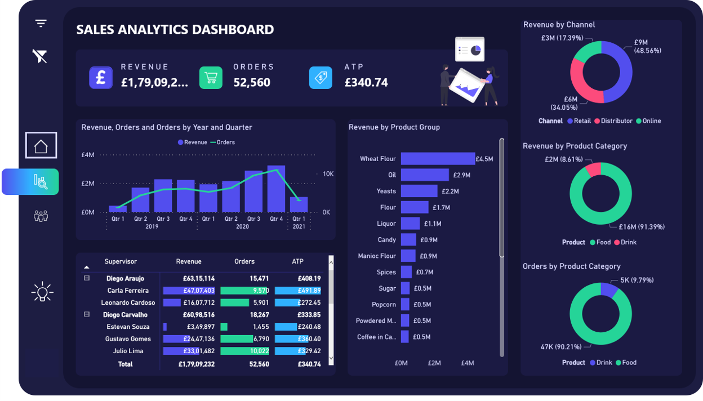
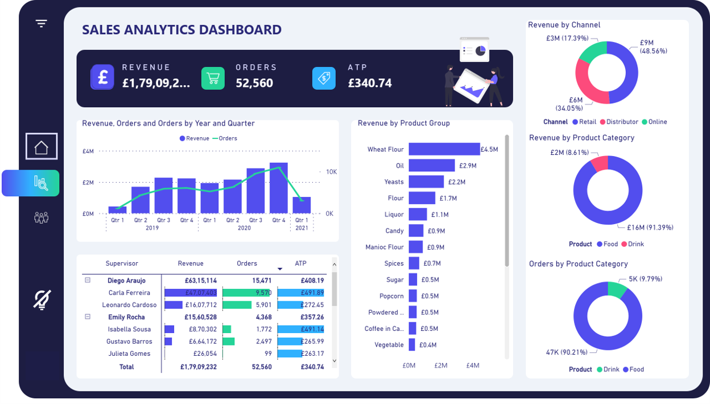
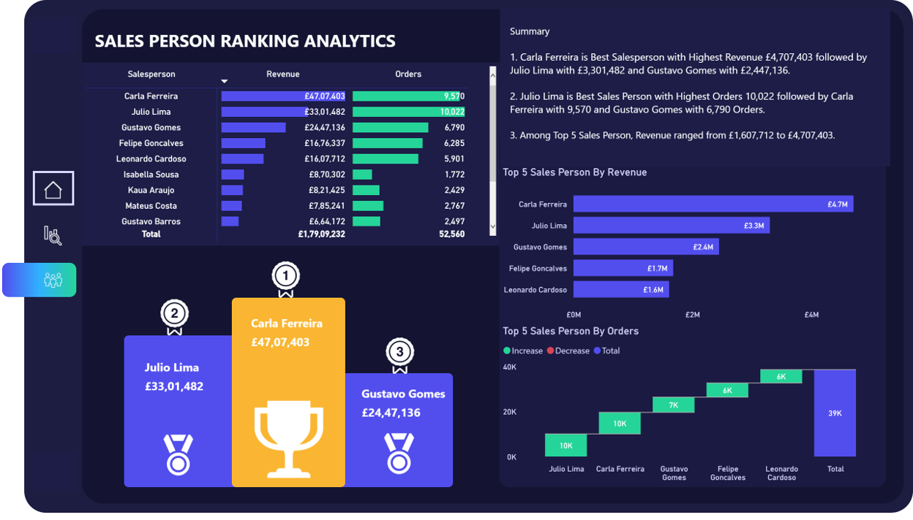

# Food Manufacturing Sales Analytics Dashboard Using Microsoft Power BI

## Overview

This project focuses on analyzing and visualizing an interactive Sales Analytics Dashboard using Microsoft Power BI for a Food Manufacturing Company located in London, United Kingdom. The datasets used are completely fictitious and solely made-up just for data analysis case study.
## Data Analysis

In this dashboard, we will uncover the patterns, trends and KPIs in the dataset to add value to the organization by answering the following questions:

1. What are the Seasonal trends in sales data over the last three years?
2. What are the Key Performance Indicators (KPI) for generating revenue and orders over the last three years?
3. What are the Product Categories, Product Groups and Channels that generate more Revenue and Sales and the least contributors?
4. Who are the Top 5 Salespersons by Revenue and Orders?
5. Who are the Top Ranking Salespersons based on their performance?

## Snaphot of the Sales Analytics Dashboard

### 1. Sales Analytics - Dark Mode

### 2. Sales Analytics - Light Mode

### 3. Sales Person Ranking Analytics

## Interactive Live Demo of Sales Analytics Power BI dashboard

Link : https://app.powerbi.com/view?r=eyJrIjoiNjJmMWNjMzMtODM4Ny00N2UxLWJhZTUtMDExYzc4ZTJlNTkzIiwidCI6ImEwODM3YzBlLWY1MmUtNDhmMy04MjdlLWEzOTNkM2Y3ZGViNyJ9

## Dashboard Features

1. Home Page with Overview of KPI's in Dashboard
2. Filter Pane Visual to filter data based on user requirements
3. Filter Clear Button to clear all filters applied in Dashboard in one go
4. Page Navigation Buttons to slide through different pages in Dashboard
5. Tool Tips on each visual to display facts and metrics
6. Flexibility in choosing Dark and Light mode dashboard based on User Experience
7. Conditional Formatting in Sales Person Ranking
8. Deployed and Accessible from anywhere online through Desktop & Mobile
